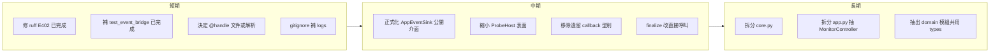

# Hello Streamer 系統性健檢報告

- 日期：2026-06-16
- 版本：stream-monitor 1.0.1
- 範圍：完整專案健檢（架構、測試、文件、技術債、安全）
- 環境：Windows 10、Python 3.11.14、uv、PyInstaller 6.20.0

本次健檢涵蓋近期由單檔 `monitor.py` 重構為 `monitor/` 套件、新增 `events/` Pub/Sub 與 probe registry 的大規模未提交變更。整體結論：**重構方向正確、行為回歸通過、可進入收斂耦合與補測試階段**；無剩餘阻斷項。

---

## 1. 自動化品質基線（階段 0）

| 檢查 | 結果 | 備註 |
|------|------|------|
| `uv sync --extra dev` | 通過 | — |
| `ruff check .` | 修復後通過 | 原本 `scripts/probe_yt_vid.py` 2 個 E402（CI 阻斷），本次已修 |
| `compileall` | 通過 | 全模組編譯成功 |
| `pytest -q` | 通過 | 健檢後 605–606 passed、1–2 skipped（Tk 環境性跳過） |
| 覆蓋率（臨時量測） | 61% | 詳見第 4 節 |

本次唯一的 CI 阻斷項（ruff E402）已修復：`scripts/probe_yt_vid.py` 因需在 import 前 `sys.stdout.reconfigure`，改以 `# noqa: E402` 保留意圖並通過 lint。

---

## 2. 重構回歸驗證（階段 1）

核心資料流 `Monitor.publish → MonitorEventBus → Bridge.tick → App 副作用` 經測試確認行為不變：

- `from stream_monitor.monitor import Monitor, ChannelEntry` 等公開匯入正常。
- `tests/test_smoke.py`：import、bridge drain、monitor→bus 往返全數通過。
- `tests/test_monitor.py`（90 案例）、`test_event_bus.py`、`test_probe_registry.py` 全綠。
- Pub/Sub 合規良好：`Monitor` 只 `publish` 事件，不直接呼叫 `App`。

---

## 3. 新增測試（階段 1.5）

針對最大測試缺口 `event_bridge.py`（重構後唯一的實質事件消費者，原僅 smoke 覆蓋）新增 `tests/test_event_bridge.py`，以無 Tk 的 recording sink 覆蓋：

- idle 模式清空 bus、不產生副作用
- watch 模式只更新列狀態、不觸發動作
- trigger 模式 `open_and_stop` 觸發動作並呼叫 `_on_stop`
- `monitor_only` 頻道跳過動作
- 背壓：超過每 tick 12 筆事件預算時 requeue
- `PollActivity` 只保留最後一筆
- `PartialStatusUpdate` / `PollStatusUpdate` 套用至列

成效：`event_bridge.py` 覆蓋率提升至 81%；新增 8 個測試全數通過。

---

## 4. 測試覆蓋缺口（階段 3）

整體 61%。重構相關模組覆蓋良好；缺口集中在 UI 與平台限定模組。

| 類別 | 模組 | 覆蓋率 |
|------|------|--------|
| 良好 | `monitor/probes/twitch.py` | 100% |
| 良好 | `monitor/probes/youtube.py` | 90% |
| 良好 | `events/*`、`event_sink.py` | 95–100% |
| 良好 | `config_manager.py` / `db.py` | 97% / 96% |
| 良好 | `monitor/core.py` | 77% |
| 良好 | `notifier.py` / `browser_win32.py` | 81% / 80% |
| 缺口 | `fetcher/twitch.py` | 55% |
| 缺口 | `single_instance.py` | 29% |
| 缺口（UI/平台） | `app.py` / `app_dialogs.py` / `tray.py` | 14% / 9% / 20% |

建議補強（非阻斷）：`fetcher/twitch.py` 的 live/offline GQL mock；`single_instance.py` 基本 lock 行為。UI 重模組以手動冒煙為主。

---

## 5. 功能與安全驗證（階段 4–5）

- URL 解析：Twitch、YouTube handle/channel 皆正確；`upcoming` 強制 `notify_only`、`video` 回傳 `None`（符合設計）。
- 網路請求：`fetcher/twitch.py`、`fetcher/youtube.py` 皆設 timeout（10s / 15s）並重用 `requests.Session`。
- 設定檔：`config_manager.save` 採暫存檔 + `replace` 原子寫入。
- 資源管理：`Monitor.request_stop` + `join(timeout=5)`，輪詢使用 `ThreadPoolExecutor` context manager 自動關閉。
- 敏感資料：本程式不需 API Token；`config.json`、`seen_videos.db*`、`browser_profile/`、`.env` 均在 `.gitignore`。
- GUI / 平台項目（雙模式操作、托盤、開機啟動、單一實例、瀏覽器視窗追蹤）需在實機手動冒煙；可自動化部分已由現有測試覆蓋。

---

## 6. 打包與版本（階段 6–7）

- 版本一致：`stream_monitor.__version__`、`pyproject.toml`、README 下載表皆為 `1.0.1`。
- `uv run python build.py` 成功產出 `dist/HelloStreamer.exe`（約 24 MB，exit 0，約 48 秒）。
- 唯一警告為 macOS-only 的 `darkdetect` AppKit ctypes import，在 Windows 無害。
- 打包產物（`dist/`、`build/`、`*.spec`）均已被 `.gitignore` 涵蓋。

---

## 7. 問題分級

### Blocker
- 無剩餘阻斷項（原 ruff E402 已於本次修復）。

### Major
1. **已處理**：`README.md` 第 58 行將 `@handle` 簡寫列為支援的網址範例，但 `parse_url("@handle")` 回傳 `None`。已於 `url_parser.py` 新增裸 handle 解析並補測試。
2. **已處理（PR6）**：`monitor/probes/host.py` 的 `ProbeHost` 介面過寬。已刪除 `host.py`，改以 `ProbeSession`（狀態）+ `ProbeFacade`（窄行為介面）取代；twitch/youtube probe 不再直接觸碰 `Monitor` 私有欄位。
3. **已處理（PR2）**：`event_bridge.py` 直接讀取 sink 私有欄位。已正式化 `AppEventSink` 公開屬性/方法契約，bridge 內不再存取 `sink._` 欄位（狀態緩衝改由 `PendingStatusStore` 承載）。
4. **已處理（PR3–PR5）**：`app.py` 與 `monitor/core.py` 過大。已抽出 `MonitorController`，並將 `core.py` 拆分為 offline / preview / wake_verify / poll_cycle 等 mixin，核心檔降至約 400 行。

### Minor
1. 遺留 callback 型別（`StatusCallback`、`OfflineCallback`、`PartialSnapshotCallback`、`PollActivityCallback`）仍定義並從 `monitor/__init__.py` 匯出，但執行期已無使用，可移除或標記 deprecated。
2. `finalize_tier1_probe` 已是 `PlatformProbe` Protocol 必要方法且 twitch/youtube 皆實作，但 `monitor/core.py:1611` 仍以 `getattr(probe, "finalize_tier1_probe", None)` 防禦呼叫，屬冗餘，可改為直接呼叫。
3. 輪替日誌 `logs/*.log.1` 未被 `.gitignore` 涵蓋（僅忽略 `*.log`），導致 `logs/stream_monitor.log.1` 出現在未追蹤清單。建議補上 `logs/` 或 `*.log.*`。
4. `docs/settings-wireframe.html` 為設計原型，尚未完全落地至 `app_dialogs.py`；建議標註狀態或補實作差異說明。

---

## 8. 建議路線圖

- 短期：本次已完成 ruff 修復與 event_bridge 測試；尚待決定 `@handle` 的修正方向、補 `.gitignore` 日誌規則。
- 中期：將 `AppEventSink` 收斂為公開方法契約，讓 bridge 不再碰私有欄位；縮小 `ProbeHost` 表面或將共用邏輯下沉至 probe 基底；清理遺留 callback 型別與 `getattr` 冗餘。
- 長期：拆分 `core.py`（offline builder、wake verify、tier preview）與 `app.py`（抽出監控生命週期控制器）；考慮抽出中性 `domain/` 模組讓 `events` 與 `monitor` 共同依賴。

---

## 附錄：本次健檢實際變更

- `scripts/probe_yt_vid.py`：兩處 import 加 `# noqa: E402`，修復 CI lint 阻斷。
- `tests/test_event_bridge.py`：新增 8 個事件橋接行為測試。

其餘為唯讀審查與量測，未變更產品程式行為。
